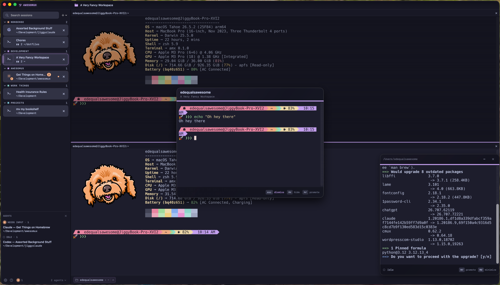

# awesoMux

<p align="center">
  
  <br />
  <br />
  <i>A Swift macOS terminal built on <a href="https://github.com/ghostty-org/ghostty">libghostty</a> with vertical sidebar tabs and first-class agent UX.</i>
</p>
<hr />

<p align="center">
  
</p>

## Who & Why 

awesoMux is a native macOS 15+ terminal built with Swift and SwiftPM. It
combines vertical sidebar tabs with agent-aware session UX in a single-window
native app.

## Architecture (summary)

- **Stack**: Swift + AppKit/SwiftUI on macOS 15+, libghostty C API for the terminal backend (linked via `GhosttyKit` + `GhosttyKitLinker`; build artifacts staged under `.build/ghostty`).
- **Layout**: SwiftPM executable **`awesoMux`**, **`AwesoMuxCore`** for testable session/agent logic, **`DesignSystem`** for shared UI surfaces, **`GhosttyKit`** modulemap/shim pointing at packaged Ghostty headers/libs.
- **Window model**: single window, vertical sidebar of sessions/tabs.
- **Persistent sessions**: the bundled `amx` backend, built from [`Interactive-Buffoonery/zmx`](https://github.com/Interactive-Buffoonery/zmx), our fork of [`neurosnap/zmx`](https://github.com/neurosnap/zmx) (MIT).
- **Agent surface**: We currently support Claude Code, Codex, OpenCode, Pi, and Grok. Don't see your agent? Feel free to open a request or a PR. See [`CONTRIBUTING.md`](CONTRIBUTING.md).
- **License**: MIT.

Full target diagram, persistence, and agent/notification model: [`docs/architecture.md`](docs/architecture.md). Keyboard reference: [`docs/shortcuts.md`](docs/shortcuts.md).

## Markdown document panes

awesoMux can open local Markdown files right next to your terminal, so you can
read, review, and mark up notes without losing sight of the agent doing the
work.

Markdown panes are meant to support the terminal, not replace it: each workspace
still keeps at least one terminal pane open. You can open local `.md` and
`.markdown` files up to 10 MB.

Entry points:

- **File > Open Markdown File…** (`⌘O`) opens a file panel seeded from
  the active pane's working directory when available.
- The command palette exposes the same **Open Markdown File…** command.
- Local Markdown links from terminal output, and Markdown links clicked inside
  another document pane, route back into awesoMux as document panes.

The review workflow is file-backed. Select rendered text to add a comment;
awesoMux writes a `<mark>...</mark><!-- USER COMMENT N: ... -->` marker pair
into the Markdown file, renders the highlight/comment in the pane, and live
reloads when the file changes. **Send to Agent** stages a plain-English nudge in
the adjacent terminal prompt without pressing Return for you; the user reviews
and sends it, then the agent resolves comments by removing the matching mark and
comment marker.


## Install

Requires macOS 15+ on Apple Silicon. Releases are Developer ID signed and notarized.

```sh
brew tap interactive-buffoonery/tap
brew install --cask awesomux
```

Or grab the latest `awesoMux-<version>.dmg` from
[Releases](https://github.com/Interactive-Buffoonery/awesomux/releases), open it,
and drag `awesoMux.app` to Applications. Download the matching `.sha256` file
and verify the DMG before opening it:

```sh
VERSION=0.2.0
shasum -a 256 -c "awesoMux-$VERSION.dmg.sha256"
```

## Getting started

Want to help us develop awesoMux? Here's how you can get started:

```sh
git clone --recursive https://github.com/Interactive-Buffoonery/awesomux.git
cd awesomux
```

If you cloned without submodules:

```sh
git submodule update --init --recursive
```

To create an isolated feature branch and worktree, initialize its submodules,
and launch an agent TUI from it:

```sh
./script/new-worktree.sh
```

The script prompts for a branch name and your choice of Pi, Claude Code, Codex,
OpenCode, or Grok, then creates the checkout under the sibling
`awesomux-worktrees` directory. Pass the branch and TUI directly for
non-interactive use, or add `--no-launch` to prepare the worktree without
starting an agent:

```sh
./script/new-worktree.sh --tui codex feature/my-change
./script/new-worktree.sh --no-launch feature/my-other-change
```

**Host tools**: **`zig`** must be on PATH the first time (or anytime) Ghostty libraries need to be built; [`script/build_ghostty_xcframework.sh`](script/build_ghostty_xcframework.sh) drives that step. Xcode's **Metal Toolchain** must also be installed so Ghostty can compile its Metal shaders:

```sh
xcodebuild -downloadComponent MetalToolchain
```

If Xcode exposes the downloaded compiler through a separate Metal toolchain, the Ghostty build script selects it automatically.

SwiftPM builds and bundles the macOS app (no Xcode project required for daily dev):

```sh
./script/build_and_run.sh
```

The script builds Ghostty artifacts when missing, runs `swift build`, stages **`dist/awesoMux.app`**, copies Ghostty **`share`** resources into the bundle, ad-hoc signs, and launches the app. To replace the local daily-driver copy in `~/Applications` and launch that installed bundle:

```sh
./script/build_and_run.sh --install
```

For terminal color/theme regressions, run the gated diagnostic launch, install
the current bundle, and then capture a probe from inside the installed app:

```sh
./script/build_and_run.sh --terminal-diagnostics
./script/build_and_run.sh --install
script/terminal-color-probe.sh --label awesomux-installed-open --claude
```

The diagnostic loop is documented in
[`docs/debugging/terminal-color-diagnostics.md`](docs/debugging/terminal-color-diagnostics.md).
Ghostty integration notes live in [`docs/ghostty-integration.md`](docs/ghostty-integration.md).

Default keyboard shortcuts (workspace, panes, floating panel) are listed in [`docs/shortcuts.md`](docs/shortcuts.md).
Release planning and checklists live in [`docs/releasing.md`](docs/releasing.md).

## Local preflight

awesoMux uses a local preflight before merging. Run it before pushing or merging app changes:

```sh
./script/preflight.sh
```

If you do not run this before opening a PR, **please note that in your PR.**

The preflight runs public-wording and Ghostty-archive guards, the sidebar
tint/status WCAG contrast gate (`script/check_tint_contrast.py`), a non-mutating
Swift format check for changed lines, the
Ghostty-aware Swift test wrapper, then builds, stages, ad-hoc signs, and
launch-verifies `dist/awesoMux.app`. Maintainers can request advisory hosted
native validation for an exact pull-request SHA with `/ci`; the full local
preflight remains the strongest pre-PR gate. Required checks, native scopes,
trust boundaries, and troubleshooting are documented in
[`docs/ci.md`](docs/ci.md).
The OpenCode review workflows run exact GLM 5.2 reviews through Synthetic for
eligible maintainer PRs and support maintainer-requested `/codereview` reruns;
they cannot publish approvals or merge.
[The OpenCode review guide](docs/code-review.md) documents review
triggers, the passive exact-SHA trust boundary, pinned installation, failure
behavior, secrets, and testing.

Format only the Swift files you intentionally changed, then inspect the diff:

```sh
./script/format.sh Sources/AwesoMuxCore/Example.swift Tests/AwesoMuxCoreTests/ExampleTests.swift
git diff --check
./script/format.sh --lint
```

The wrapper excludes vendored and generated sources. Write mode requires
explicit first-party file paths; `--lint` does not modify files and reports
formatter findings only on Swift lines changed from `origin/main` (or the
`FORMAT_LINT_BASE` override used by CI). Swift and `swift-format` versions are
pinned and their update procedure is documented in
[`docs/toolchain.md`](docs/toolchain.md).

OpenCode uses exact GLM 5.2 through Synthetic with no model fallback. The
reviewer has no approval or merge capability.

You can also run the contrast gate alone when iterating on design-system
tokens or sidebar chrome:

```sh
python3 script/check_tint_contrast.py
```

PRs that touch design-system color tokens, the audited sidebar views, or the
contrast script also run this gate automatically via
[`.github/workflows/tint-contrast.yml`](.github/workflows/tint-contrast.yml).

## Contributing

awesoMux welcomes contributions. We are pro-AI for coding, when it includes a human in the loop. See
[`CONTRIBUTING.md`](CONTRIBUTING.md) for the project expectations around pull
requests, AI disclosure, and local validation.

Please also see the project's [Code of Conduct](CODE_OF_CONDUCT.md),
[security policy](SECURITY.md), and [third-party notices](THIRD_PARTY_NOTICES.md).

**We do not believe in using AI for creative endeavours.** All images for awesoMux are created by a real, human artist. Thank you to [Amanda Wood](http://nevernotamandawood.com) for creating our app icon!

## License

[MIT](LICENSE).
